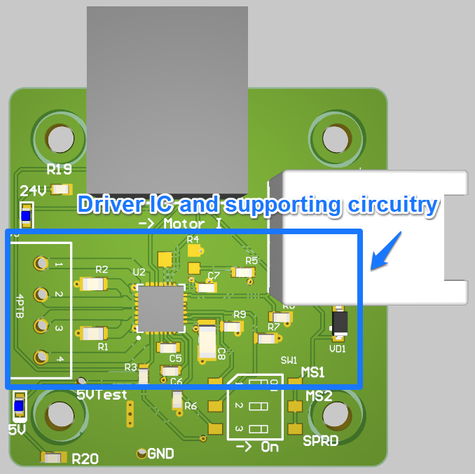

## Overview 
The electrical subsystem was designed with 3 key elements in mind: 

* Plug and Play operation 
* System Reliability 
* Expandable operation 

Plug-and-Play operation was taken to mean minimal requirements for hookups and other connections and to prioritize standard connectors that are easily available from commercial outlets. System Reliability was necessary for operation under a wide variety of conditions (wide Vin range, built-in protections, and temperature/humidity resistance) and to limit repairs by the user. Finally, it was assumed that this system should be able to accommodate other configurations than just a 3D CNC gantry and should have features that can be expanded for later development. 

## System Diagram 

A system diagram was created to help design the infrastructure and architecture for the overall system. In this case my idea was to approach every operable component as a "node" which could act as an independent unit. The reasoning being that I could assign each "node" to team members and give them a black box explanation for each. As an example, the motor node circuit needed to operate using the following parameters: 

| Parameter             | Valid Ranges                        |
|---------------------|--------------------------------------:|
| Vin Range           | 12 -30 V                              |
| Motor Current (rms) | 2A                                    |
| Signal Inputs       | Step, EN, DIR, (STEP/DIR CNC Control) |
| Step Frequency      | <= 5Khz                               |
| Microstepping       | 1x - 16x                              |
| Input Interface     | RJ45 - 8 pin                          |

By providing the specification and known inputs / outputs I could keep each node organized and have the ability to assign its development to any members that were working under my at the time. 

The main blocks in the system diagram that needed to be developed were: 
* Integrated Stepper Driver (Motor Node) 
    * Motor controller using DIR/STEP controls (or eventually UART)
* ESP32 GRBL Controller 
    * This node was meant to be the main firmware controller which would determine the signals to be sent to each motor to tell it where to move. This could be abstracted to basically just run any CNC control firmware such as Marlin, GRBL, or LinuxCNC. While researching it was determined that the ESP32 GRBL firmware met all the requirements and more with little to no development necessary (see the ESP32 GRBL section)

## Motor Nodes

The Motor Node PCB was meant to be an independent solution for stepper motor control. The idea was there could be many motor "nodes" which could be controlled using a known standard protocol. The controlling board could be adaptable to a variety of stepper motor types and would be easily mounted to the motor itself. 

The node has 3 I/O connectors for different purposes. The RJ45 connector (commonly used as an Ethernet connector) is used for Power and Control to the Stepper Driver IC: 

The pinout diagram can be found on the schematic pdfs which are included within the documentation under "HyperRail\PCB Files\Integrated Stepper Motor Driver-(fab,pcba)\PCBA-Integrated Stepper Motor Driver"

### Stepper IC 

* Red (bottom right) | RJ-45 Pinout   
    * This Pinout is used for Power input and control signals to the TMC2209 driver IC 
* Pink (Top) | Sense Resistors 
    * The sense resistor selection is incredibly important to the TMC driver current limits. If a larger / smaller motor is required, then these should be changed to reflect that using the recommended lookup table (taken from TMC2209 Datasheet, section 8): 
    
* Yellow | VRef Selection 
    * The VRef circuit uses a simple voltage divider to maintain "soft" current limits. The idea is that the sense resistors set the "hard" current limits in that they are hardware defined whereas the voltage divider circuit allows the user to customize "soft" limits. A radial potentiometer is used for adjustable resistance and a silkscreen diagram is provided to indicate the direction to turn to increase motor current. 
* Blue | Motor Phase Outputs 
    * The output for the motor phase currents from the Stepper Driver IC is a simple 4 pin screw terminal. This allows users to use a variety of stepper motors without having to find / assemble special connectors. All that's necessary is to determine the phase diagram, strip the wires and plug in. 
    

### Power Conversion and Status LEDs

* Red | Buck Converter 
    * Main buck operating circuit which are simply an input and output capacitor and the integrated module. 
* Blue | Reverse-Protection Diode 
    * Prevents negative spikes or reverse current 

Power Conversion is done using an integrated buck controller / switch, the TI  [LMZM23601V5SILR](https://www.ti.com/product/LMZM23601). This is a wide Vin range (4 -> 36V) buck converter which will step down the power input (expected 12 - 24V) to logic level (5V) for the Stepper Driver. Not much current is expected for this application, the estimated current draw by the driver for logic level is 10mA max: 

There are 2 physical test points which were designed for multimeter probes to easily measure the voltage output during manufacture and testing. 
## ESP-32 Controller

The ESP-32 Controller was designed to be the liaison between motion requests by the ROS software and the rest of the machine. The board itself is computationally powered with an ESP32-WROOM module (either through a daughter dev-board or embedded on the board) running the [GRBL_ESP32](https://github.com/bdring/Grbl_Esp32) firmware. A key aspect of using the GRBL style firmware over other flavors (such as Marlin or otherwise) is that GRBL supports the ESP32 with no prerequisite and can support a Web-UI natively for manual control. 

### GRBL Interfaces 
The main interfaces to GRBL is through the USB port on the ESP32 Microcontroller, there is a secondary interface through a web-http server based locally on the ESP32 itself. GRBL is a G-code interpreter which means it will take standard GCode formatted information to command the stepper motors. Common examples are: 

"G0 X100 Y10 Z20" - Fast linear move to 100mm X, 10mm Y, 20mm Z at the fastest rate possible (max speed)

"G01 X100 Y100 Z10 F2000" - Normal linear move to 100mm X, 100mm Y, 10mm Z at a rate of 2000mm/min 

There are internal "machine" specific settings that can be changed within GRBL to adapt to different designs. These are normally modified by sending a "$\<X\>" where X is the command number to modify. A full list is provided below:

| Settings and sample values | Description |
| --- | --- |
| $0=10        | [Step pulse, microseconds]             |
| $1=25        | [Step idle delay, milliseconds]  |
| $2=0         | [Step port invert, mask]                 |
| $3=0         | [Direction port invert, mask]       |
| $4=0         | [Step enable invert, boolean]      |
| $5=0         | [Limit pins invert, boolean]       |
| $6=0         | [Probe pin invert, boolean]         |
| $10=1        | [Status report, mask]                   |
| $11=0.010    | [Junction deviation, mm]               |
| $12=0.002    | [Arc tolerance, mm]                         |
| $13=0        | [Report inches, boolean]               |
| $20=0        | [Soft limits, boolean]                   |
| $21=0        | [Hard limits, boolean]                 |
| $22=1        | [Homing cycle, boolean]                 |
| $23=0        | [Homing dir invert, mask]            |
| $24=25.000   | [Homing feed, mm/min]                    |
| $25=500.000  | [Homing seek, mm/min]                     |
| $26=250      | [Homing debounce, milliseconds] |
| $27=1.000    | [Homing pull-off, mm]                     |
| $30=1000.    | [Max spindle speed, RPM]             |
| $31=0.       | [Min spindle speed, RPM]              |
| $32=0        | [Laser mode, boolean]                     |
| $100=250.000 | [X steps/mm]                       |
| $101=250.000 | [Y steps/mm]                         |
| $102=250.000 | [Z steps/mm]                         |
| $110=500.000 | [X Max rate, mm/min]
| $111=500.000 | [Y Max rate, mm/min]          |
| $112=500.000 | [Z Max rate, mm/min]         |
| $120=10.000  | [X Acceleration, mm/sec^2])   |
| $121=10.000  | [Y Acceleration, mm/sec^2]   |
| $122=10.000  | [Z Acceleration, mm/sec^2]   |
| $130=200.000 | [X Max travel, mm]                 |
| $131=200.000 | [Y Max travel, mm]                 |
| $132=200.000 | [Z Max travel, mm]                 |

### Stepper Outputs 

The Stepper outputs are provided from the ESP32 as STEP-EN-DIR pins in the RJ45 form-factor. A pulse is sent on each line to command specific instructions to the stepper drivers. 

In this case the STEP pin will pulse each time the controller wants the motor to "step" forward by one increment. Depending on the motor this could be 1/2° or more. Most general stepper motors you can buy online are rated at 200 steps/revolution so a simple calculation means every "step" pulse will move the motor shaft forward by 1 * 360/200 degrees or 1.8°. 

The EN pin simply enables the stepper driver and can be used to quickly disable the steppers whenever necessary. 

The DIR pin is used to indicate the direction the stepper motor should move. HIGH/LOW will control the clockwise/counter-clockwise directions and will depend on the specific stepper driver being used. 

All the pins are using 3.3V as a standard voltage. The ESP32 controls each stepper's outputs independently using a single I2C bus and packets sent to a decoder downstream. These decoders will be the ones to actually toggle the output pins HIGH/LOW. 

A consideration is that these signals are only 3.3V standard with no current control meaning for extended lengths of cable there could be induced noise at the end termination. Since 2/3 of these signals can be approximated as DC (EN and DIR do not change rapidly) they can be ignored. The STEP pin has the potential to induce EMI due to its switching nature but so long as the frequency stays below the 10s of KHz and the cabling is shielded there shouldn't be too many issues.

The TMC2209 specifies a max step frequency of 1/2 fclk which for a default configuration fclk ~= 12MHz so max step freq is 6MHz. This does not translate well to a physical motor however since the inertial load and current demand for a 6MHz motor stepping would be astronomical. The best way to calculate the max step frequency is to derive the max speed from the Torque-speed curve of the desired motor and translate that into steps/sec. For example, a typical NEMA 17 motor has the following motor curve (this can be different per manufacturer): 

Let's say the desired torque is ~0.45 Nm meaning the max speed would be 300 rpm. 300 rpm translates to 300 rev/min * 200 pulse/rev = 60000 pulses/minute or 1000 pulses/sec. Meaning the max step frequency for this motor at our desired torque would be 1000 Hz or 1KHz. This is well below our recommended max of 6MHz and is sufficiently slow to not cause EMI in our lines. 

#### Basic I2C command structure

GRBL32 can be configured to send commands using the I2C protocol to save on pin space on the actual microcontroller. For most implementations you would need a separate pin for STEP/DIR for each motor (and then each motor can share an EN pin) but that would mean reserving up to 3*2 + 1 = 7 pins for just 3 motors. With the I2C protocol you can use a 2-pin serial bus to quickly send packets of binary information to a decoder which will then act as the output pins. This gives more pin space for the microcontroller at the cost of increasing the circuit overhead. 

### End Stop Inputs 

### Status LEDs

### Input Power 

### Secondary ESP32 

## Magnetic End Stops

## Main System

